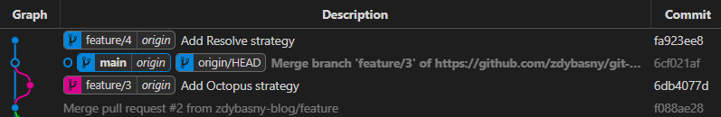

# merge, squash & rebase

#git #github

## Pull Requests in GitHub

One of common practice of contribute with a developer's solution to the common main code base are Pull Requests^[*Are pull request a good practice?* Dave Farley doubts it on: [Why Pull Requests Are A BAD IDEA](https://www.youtube.com/watch?v=ASOSEiJCyEM)]. On GitHub you can chose 3 ways of closing them with adding the code to the main branch.


As we can see, **merges, squashes, and rebases** are explanted in the GitHub repository settings. So we can close the topic, can't we?

Not yet. Those commits types are a little bit more complex. Let's go into details to understand what happens under the hood of git.

## Overview

[źródło](<https://medium.com/@shubhpaliwal98/when-to-use-squash-merge-and-rebase-43da3571dcbe>)

### merge

What is the state of GitHub's `Merge pull request`?


What has happened here?

#### Theory of merge

Before we can reproduce it with raw git commands, lets get know what is **merge**.

According to the [git documentation](https://git-scm.com/docs/git-merge):

> Incorporates changes from the named commits \[...] into the current branch. This command is used by `git pull`^[*What is the difference between `git pull` and `git merge`?* `git pull <remote> <branch>` is just a shortcut to the commands: `git fetch <remote>` then `git merge <remote>/<branch>`] to incorporate changes from another repository.

A branch in the `git pull <remote> <branch>` is the source branch to merge into the current branch.

#### Merge in practice

Now let's reproduce the GitHub's merge with following git commands:

```terminal
$ git checkout main

Switched to branch 'main'
Your branch is up to date with 'origin/main'.
```

```terminal
$ git pull origin feature/3 --no-ff

From https://github.com/zdybasny/git-merges-strategies
 * branch            feature/3  -> FETCH_HEAD
Merge made by the 'ort' strategy.
 README.md | 4 ++++
 1 file changed, 4 insertions(+)
```


```terminal
$ git push

Enumerating objects: 1, done.
Counting objects: 100% (1/1), done.
Writing objects: 100% (1/1), 263 bytes | 263.00 KiB/s, done.
Total 1 (delta 0), reused 0 (delta 0), pack-reused 0
remote: This repository moved. Please use the new location:
remote:   https://github.com/zdybasny-blog/git-merges-strategies.git
To https://github.com/zdybasny/git-merges-strategies.git
   f088ae2..6cf021a  main -> main
```


There a several things to explain:

1. The listings of `git push` command are skipped below to keep the article cleaner.
2. The `feature` branch has been removed in the meantime since it blocked to create `feature/3`^[*Do not call your branches just `feature` or `release`.* Read more [how to fix it](#cannot-lock-ref) below)].
3. The deletion of feature branches is a good practice anyway.
4. Even the branch has been removed, there is still its branch of history exists. This is the result of `--no-ff` option of `git pull`.

**So what is wrong with this simple and easy merge?**

❌ It generates a new commit which doesn't provide any meaningful changes, it juts merges the history of both branches. Finally having 2 branches and extra commits, the result is not the cleanest we could imagine. Especially when a team doesn't remove closed feature branches. Even if the team or an automated rule removed all feature branches after pull requests were closed, the git history would remain look like rails in the train barn.

❌ The second awful thing in the "simple merge" is commit messages contributors writes too often. Keeping the history clean requires discipline and consistency.


But this is the topic for a separate post how to write a good commit messages and how to use GitHub to do so.

✅ On the other hand, *merge* keeps entire history if you really need to have such.

✅ The most important benefit of *merge* is it doesn't rewrite the history.

#### `--ff` or `--no-ff`, or `ff-only`, what is that question?

GitHub merges branches with `--no-ff` option only what means **no fast forward**.

So what does *fast forward* `--ff` option mean? Git simply moves the pointer forward. Let's check it in practice.



```terminal
$ git pull origin feature/4 --ff

From https://github.com/zdybasny/git-merges-strategies
 * branch            feature/4  -> FETCH_HEAD
Updating 6cf021a..fa923ee
Fast-forward
 README.md | 4 ++++
 1 file changed, 4 insertions(+)
```

```terminal
$ git push

Total 0 (delta 0), reused 0 (delta 0), pack-reused 0
remote: This repository moved. Please use the new location:
remote:   https://github.com/zdybasny-blog/git-merges-strategies.git
To https://github.com/zdybasny/git-merges-strategies.git
   6cf021a..fa923ee  main -> main
```

BTW `--ff` is the default strategy^[unless merging an annotated (and possibly signed) tag that is not stored in its natural place in the refs/tags/ hierarchy, in which case --no-ff is assumed [[source](https://git-scm.com/docs/git-merge#Documentation/git-merge.txt---ff)]]:

```terminal
$ git pull origin feature/4

From https://github.com/zdybasny/git-merges-strategies
 * branch            feature/4  -> FETCH_HEAD
Updating 6cf021a..fa923ee
Fast-forward
 README.md | 4 ++++
 1 file changed, 4 insertions(+)
```

The result:


So `--ff` keeps a history linear till it is possible to just move the pointer. If it is not possible, `--no-ff` is taken. If you want to keep *fast forward*, `--ff-only` rejects the pull operation is *fast forward* is not possible.

Here is a scenario when *fast forward* is not possible:


```terminal
$ git pull origin feature/5 --ff-only

From https://github.com/zdybasny/git-merges-strategies
 * branch            feature/5  -> FETCH_HEAD
fatal: Not possible to fast-forward, aborting.
```

Then `--ff` is switched to `--no-ff`:

```terminal
$ git pull origin feature/5 --ff

From https://github.com/zdybasny/git-merges-strategies
 * branch            feature/5  -> FETCH_HEAD
Merge made by the 'ort' strategy.
 new-file.md | 3 +++
 1 file changed, 3 insertions(+)
 create mode 100644 new-file.md
```

with result:


At the end 2 bonus questions. What will the command below do for `feature/5` branch:

- `git pull origin main --no-ff`?
- `git pull origin main --ff`?

Results:

...

...

...

`--no-ff`:


Better do not do that 😱

`--ff`:


Much cleaner 🤩

## NEXT CHAPTERS

### pros & cons in practice

### GitHub repository settings

### rebase in practice

### When to use?

### rebase/reset

>git pull --rebase

rebase edit/reword: <https://stackoverflow.com/questions/30194796/git-rebase-whats-the-difference-between-edit-and-reword>

### conflicts

When conflicts occurs, there is syntax `git merge --continue` to commit the resolved changes, or `git merge --abort` to reset the uncommitted changes from *incoming* ^[*Why incoming, not remote?* Stashes are not on remote nor local.
*So where exactly are stashes stored if not on the local nor the remote?* `./.git/refs/stash`] and local. **Warning:** make sure you have no uncommitted changes before the merge you do not want to loose.
