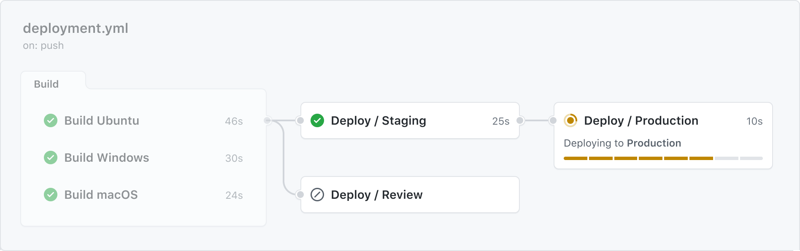

#github #pipelines

**Przepływ pracy** (**workflow**) jest konfigurowalnym, zautomatyzowanym procesem, który uruchamia jeden lub więcej [Jobów](Job.md). **Workflow** jest definiowany przez plik YAML, który jest dołączony do repozytorium.

##### Spis treści

- [Trigger](#trigger)
- [Plik workflow](#plik%20workflow)
  - [Workflow syntax](#workflow%20syntax)
  - [Workflow command](#workflow%20command)
    - [Environment file](#environment%20file)
    - [Toolkit functions](#toolkit%20functions)
- [Reużywanie zasobów](#Reużywanie%20zasobów)
  - [Reużywanie workflow](#reużywanie%20workflow)
    - [Sposoby na reużycie workflow](#sposoby%20na%20reużycie%20workflow)
    - [Dostęp do reużywalnego workflow](#dostęp%20do%20reużywalnego%20workflow)
      - [Kontekst w wywołanym workflow](#kontekst%20w%20wywołanym%20workflow)
      - [Token (GITHUB_TOKEN & PAS - personal access token)](#Token%20GITHUB_TOKEN%20PAS%20-%20personal%20access%20token)
      - [Ograniczenia](#ograniczenia)
  - [Reużywanie zmiennych środowiskowych](#Reużywanie%20zmiennych%20środowiskowych)
    - [env](#env)
    - [$GITHUB_ENV](#GITHUB_ENV)
    - [$GITHUB_PATH](#GITHUB_PATH)
  - [Workflow artifact](#Workflow%20artifact)
    - [upload-artifact](#upload-artifact)
    - [download-artifact](#download-artifact)
  - [Cache'owanie zależności](#Cache'owanie%20zależności)

# Trigger

[źródło](https://docs.github.com/en/actions/using-workflows/triggering-a-workflow)

Workflow jest uruchamiany, gdy zostanie wowołany [Event](Event.md) w postaci:

- [Eventu](Event.md) GitHuba odnoszący się do repozytorium [pliku workflow](#Plik%20workflow): [`on`](Workflow%20syntax.md#on),
- [Event](Event.md) poza GitHubem wywołujący `repository_dispatch`,
- ręcznie: [`on.workflow_dispatch`](Workflow%20syntax.md#on%20workflow_dispatch),
- lub według określonego harmonogramu: [`on.schedule`](Workflow%20syntax.md#on%20schedule).
- Twoje repozytorium może posiadać **wiele przepływów** pracy w repozytorium, z których każdy może wykonywać inny zestaw **kroków**.

# Plik workflow

[źródło](https://docs.github.com/en/actions/using-workflows/workflow-syntax-for-github-actions)

GitHub Actions wykorzystują składnię `YAML` do definiowania przepływu pracy. Każdy przepływ pracy przechowywany jest jako osobny plik `YAML` w repozytorium kodu, w katalogu o nazwie `.github/workflows`.

## Workflow syntax

Elementy składni `YAML` dla workflow są opisane w [Workflow syntax](Workflow%20syntax.md).

## Workflow command

[źródło](https://docs.github.com/en/actions/using-workflows/workflow-commands-for-github-actions)

Akcje mogą komunikować się z maszyną [Runnera](Runner.md) w celu:

- ustawiania zmiennych środowiskowych,
- wyprowadzania wartości używanych przez inne akcje,
- dodawania komunikatów debugowania do logów wyjściowych
- wykonywania innych zadań.

Większość **workflow command** używa polecenia `echo` w określonym formacie (patrz [Toolkit functions](#Toolkit%20functions)),
podczas gdy inne wywoływane są przez zapis do pliku (patrz: [Environment file](#Environment%20file)).

### Environment file

[źródło](https://docs.github.com/en/actions/using-workflows/workflow-commands-for-github-actions#environment-files)

Podczas wykonywania **workflow**, [Runner](Runner.md) generuje pliki tymczasowe, które mogą zostać użyte do wykonania pewnych [Actions](Action.md). Ścieżki do tych plików są udostępniane przez zmienne środowiskowe.

> Wiele poleceń może być zapisanych do tego samego pliku, oddzielonych znakami nowej linii.

### Toolkit functions

[źródło]((<https://docs.github.com/en/actions/using-workflows/workflow-commands-for-github-actions#using-workflow-commands-to-access-toolkit-functions>)

[actions/toolkit](https://github.com/actions/toolkit) zawierają liczne funckje, kótre można wywołać z użyciem **workow commands**.
W tym celu użyj składni `::`, by wysłać komendę do [Runnera](Runner.md) poprzez `stdout`.

Np. zamiast:

```javascript
core.setOutput('SELECTED_COLOR', 'green');
```

to z użyciem **workflow command**:

```yaml
      - name: Set selected color
        run: echo '::set-output name=SELECTED_COLOR::green'
        id: random-color-generator
      - name: Get color
        run: echo "The selected color is ${{ steps.random-color-generator.outputs.SELECTED_COLOR }}"
```

| Toolkit function      | Equivalent workflow command                                                |
| --------------------- | -------------------------------------------------------------------------- |
| `core.addPath`        | Dostępne przy użyciu [Environment file](#Environment%20file) `GITHUB_PATH` |
| `core.debug`          | `debug`                                                                    |
| `core.notice`         | `notice`                                                                   |
| `core.error`          | `error`                                                                    |
| `core.endGroup`       | `endgroup`                                                                 |
| `core.exportVariable` | Dostępne przy użyciu [Environment file](#Environment%20file) `GITHUB_PATH` |
| `core.getInput`       | Dostępne przy użyciu zmiennej środowiskowej variable `INPUT_{NAME}`        |
| `core.getState`       | Dostępne przy użyciu zmiennej środowiskowej variable `STATE_{NAME}`        |
| `core.isDebug`        | Dostępne przy użyciu zmiennej środowiskowej variable `RUNNER_DEBUG`        |
| `core.saveState`      | `save-state`                                                               |
| `core.setCommandEcho` | `echo`                                                                     |
| `core.setFailed`      | Używane jako skrót do `::error` i `exit 1`                                 |
| `core.setOutput`      | `set-output`                                                               |
| `core.setSecret`      | `add-mask`                                                                 |
| `core.startGroup`     | `group`                                                                    |
| `core.warning`        | `warning`                                                                  |

# Reużywanie zasobów

## Reużywanie workflow

[źródło](https://docs.github.com/en/actions/using-workflows/reusing-workflows)



### Sposoby na reużycie workflow

Można odwoływać się do workflow w ramach innego przepływu poprzez:

- wygenereowanie [Eventu](Event.md), który oczekuje inny **workflow** (patrz [Token...](#Token%20GITHUB_TOKEN%20PAS%20-%20personal%20access%20token)),
- bezpośrednie wywołanie [`on.workflow_call`](Workflow%20syntax.md#on%20workflow_call) przez  [`jobs.<job_id>.uses`](Workflow%20syntax.md#jobs%20job_id%20uses).

### Dostęp do reużywalnego workflow

W zależności od widoczności repozytorium, można wywołać **workflow**:

- `private` - tylko na tym samym repozytorium co **workflow**, wywołujący,
- `internal` - tylko na repozytoriach w ramach organizacji,
- `public` - bez ograniczeń.

#### Kontekst w wywołanym workflow

Jeśli reużyjemy **workflow** z innego repozytorium, wszelkie [Actions](Action.md) w wywołanym **workflow** uruchamiana są tak, jakby były częścią wywołującego **workflow**.

Gdy reużywalny **workflow** jest wywoływany przez inny **workflow**, [Context](Context.md) `github` jest zawsze skojarzony z **workflow** wywołującym, a wywołany **workflow** automatycznie otrzymuje dostęp do `github.token` oraz [`secrets.GITHUB_TOKEN`](Security.md#GITHUB_TOKEN).

#### Token (GITHUB_TOKEN & PAS - personal access token)

Gdy używamy [`secrets.GITHUB_TOKEN`](Security.md#GITHUB_TOKEN) repozytorium do wykonywania zadań, [Eventy](Event.md) wywołane przez [`secrets.GITHUB_TOKEN`](Security.md#GITHUB_TOKEN) nie będą tworzyły nowego **workflow**. Zapobiega to przypadkowemu tworzeniu rekurencyjnych przebiegów pracy.

Jeśli jednak potrzeba, aby **workflow** uruchomił inny **wrokflow**, należy użyć **PAS** ([Personal access token](Security.md#Personal%20access%20token)) zamiast [`secrets.GITHUB_TOKEN`](Security.md#GITHUB_TOKEN) do wyzwalania [Eventów](Event.md) wymagających tokena. PAS tworzy się i przechowuje go jako sekret.

```yaml
on:
  issues:
    types:
      - opened

jobs:
  label_issue:
    runs-on: ubuntu-latest
    steps:
      - env:
          GITHUB_TOKEN: ${{ secrets.MY_TOKEN }}
          ISSUE_URL: ${{ github.event.issue.html_url }}
        run: |
          gh issue edit $ISSUE_URL --add-label "triage"
```

> Aby zminimalizować koszty korzystania z GitHub Actions, upewnij się, że nie tworzysz rekurencyjnych lub niezamierzonych **workflowów**.

#### Ograniczenia

Reużywalny **workfliow**:

- **nie może** wywoływać innych reużywalnych **workflowów**;
- jeśli znajduje się w prywatnym repozytorium, może być wywołany tylko z tego samego repozytorium;
- nie otrzymuje poprzez propagaję zmiennych środowiskowych ustawionych w [Context](Context.md) `env` na poziomie **workflow** wywołującym
- nie obsługuje atrybutu [`jobs.<job_id>.strategy`](Workflow%20syntax.md#jobs%20job_id%20strategy) w żadnym [Jobie](Job.md), który go wywołał.

### Przekazywanie danych wejściowych i sekretów

Aby przekazać nazwane dane wejściowe do wywołanego **Workflow** ([`on.workflow_call.inputs`](Workflow%20syntax.md#on%20workflow_call%20inputs)), należy użyć [`jobs.<job_id>.with`](Workflow%20syntax.md#jobs%20job_id%20with). Typ danych musi być zgodny z typem określonym w wywołanym **Workflow** (`boolean`, `number` lub `string`).

Do przekazania nazwanych sekretów  wywołanego **Workflow** ([`on.workflow_call.secrets`](Workflow%20syntax.md#on%20workflow_call%20secrets)), należy użyć [`jobs.<job_id>.secrets`](Workflow%20syntax.md#jobs%20job_id%20secrets).

Przykład:

**Workflow** reużywalne:

```yaml
on:
  workflow_call:
    inputs:
      username:
        description: 'A username passed from the caller workflow'
        default: 'john-doe'
        required: false
        type: string
    secrets:
		 accessToken:
			 description: 'A token passed from the caller workflow'
			 required: false

jobs:
  pass-secret-to-action:
    runs-on: ubuntu-latest

    steps:
      - name: Pass the received secret to an action
        uses: ./.github/actions/my-action
        with:
			  username: ${{ inputs.username }}
			  token: ${{ secrets.accessToken }}
```

**Wrokflow** wywołujące:

```yaml
jobs:
  call-workflow-passing-data:
    uses: octo-org/example-repo/.github/workflows/reusable-workflow.yml@main
    with:
      username: mona
    secrets:
      accessToken: ${{ secrets.envPAT }}
```

## Reużywanie zmiennych środowiskowych

[źródło](https://docs.github.com/en/actions/learn-github-actions/environment-variables)

#TODO

### env

[źródło](https://docs.github.com/en/actions/using-workflows/workflow-syntax-for-github-actions#env)

<https://docs.github.com/en/actions/using-workflows/workflow-syntax-for-github-actions#env>

<https://docs.github.com/en/actions/using-workflows/workflow-syntax-for-github-actions#jobsjob_idstepsenv>

https://docs.github.com/en/actions/using-workflows/reusing-workflows#limitations

env ustawiony w Workflow wywołującym nie przenosi się do `env` Workflow'u reużywanego.
Dostępny jest natomiast w Action, o czym powinien informować plik `README.md`.

### $GITHUB_ENV

[źródło](https://docs.github.com/en/actions/using-workflows/workflow-commands-for-github-actions#setting-an-environment-variable)

> **Krok**, który tworzy lub aktualizuje zmienną środowiskową, nie ma dostępu do nowej wartości, ale wszystkie kolejne **kroki** w zadaniu będą miały do niej dostęp.

### $GITHUB_PATH

[źródło](https://docs.github.com/en/actions/using-workflows/workflow-commands-for-github-actions#adding-a-system-path)

## Workflow artifact

[źródło](https://docs.github.com/en/actions/using-workflows/storing-workflow-data-as-artifacts)

#TODO

### upload-artifact

### download-artifact

## Cache'owanie zależności

[źródło](https://docs.github.com/en/actions/using-workflows/caching-dependencies-to-speed-up-workflows)

#TODO
